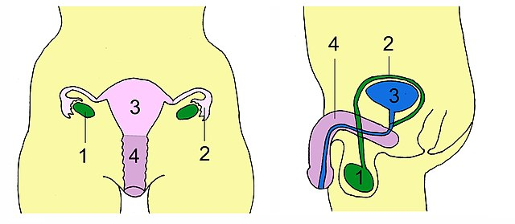
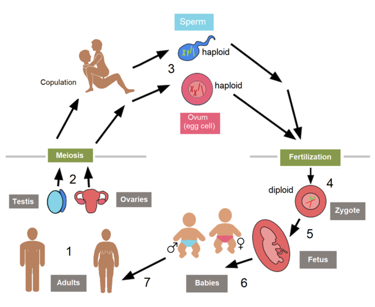
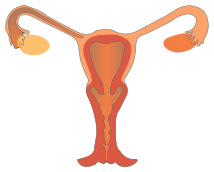

# Thema 2 - Basisstof 8 Geboorteregeling


## Joost

- [Basisstof 8 Geboorteregeling](https://youtu.be/XG9qEsMbxrc?si=75R23e5LyywSCo0d)

## Samenvatting

### doelstelling 13 basisstof 8

```
Je kunt methoden van geboorteregeling beschrijven en
aangeven of ze betrouwbaar zijn of niet.
```

- Geboorteregeling of anticonceptie: je bepaalt zelf of
    je een kind wilt of niet.
- Periodieke onthouding: geen
    geslachtsgemeenschap in de vruchtbare periode
    rond de ovulatie.
	- Onbetrouwbaar doordat het tijdstip van ovulatie
    niet precies is vast te stellen.
- Coïtus interruptus: de man trekt zijn penis net voor
    de zaadlozing terug uit de vagina.
	- Onbetrouwbaar doordat in het voorvocht
    zaadcellen kunnen voorkomen.
- Condoom: een latex hoesje wordt om de
    penis gerold of in de vagina aangebracht
    (vrouwencondoom).
	- Een condoom verhindert dat er sperma in de
    vagina komt en beschermt tegen soa’s.
	- Betrouwbaar.
- De pil, de prikpil en de NuvaRing: bevatten
       hormonen die ervoor zorgen dat er geen ovulatie
       plaatsvindt.
    - Betrouwbaar.
    - De pil moet dagelijks worden ingenomen.
    - De prikpil wordt om de drie maanden
       geïnjecteerd.
    - De NuvaRing moet één keer per maand in de
       vagina worden ingebracht.
    - De NuvaRing en de pil hebben na drie weken een
       stopweek. In deze week treedt de menstruatie
       op.
- Spiraaltje: wordt in de baarmoeder aangebracht en
       kan vijf jaar blijven zitten.
    - Hormoonspiraaltje: door de werking van
       hormonen worden bevruchting en innesteling
       nagenoeg onmogelijk.
    - Koperspiraaltje: door het koperdraadje worden
       zaadcellen beschadigd en wordt innesteling
       bemoeilijkt.
    - Spiraaltjes zijn betrouwbaar.
- Pessarium: een rubber koepeltje dekt de
       baarmoedermond af.
    - Wordt ingesmeerd met een zaaddodend middel.
    - Een pessarium moet na de
       geslachtsgemeenschap nog acht uur blijven
       zitten.
    - Minder betrouwbaar.
- Sterilisatie.
    - Bij een man worden de zaadleiders onderbroken.
    - Er vindt een zaadlozing zonder zaadcellen
       plaats.
    - Bij een vrouw worden de eileider onderbroken of
       geblokkeerd.
    - Na sterilisatie gaat de menstruatiecyclus gewoon
       door.
    - Sterilisatie is een blijvende ingreep.
    - Betrouwbaar.

### doelstelling 14 basisstof 8

```
Je kunt noodmaatregelen tegen ongewenste zwangerschap noemen.
```

- Bij geen of verkeerd gebruik van een
    voorbehoedmiddel worden noodmaatregelen
    genomen tegen zwangerschap.
	- Morning-afterpil: deze pil bevat een grote
    hoeveelheid hormonen die ovulatie of
    innesteling voorkomen. Zo snel mogelijk na de
    geslachtsgemeenschap innemen tot maximaal
    drie dagen na de geslachtsgemeenschap.
- Abortuspil: kan tot en met de zevende week
    van de zwangerschap worden geslikt. Hierdoor
    worden het embryo en het baarmoederslijmvlies
    afgestoten.
- Zuigcurettage: met een zuigpompje wordt
    het baarmoederslijmvlies met het embryo
    weggezogen. Een zuigcurettage is een vorm van    abortus die tot en met de dertiende week van de zwangerschap kan worden uitgevoerd.
- Late abortus kan na de dertiende week
    plaatsvinden tot en met de 23e week van de
    zwangerschap.


## Vragen
1. Wat is ovulatie?
1. Wat is menstruatie?
1. Welke zijn 3 meest gebruikte anticonceptie of geboorteregeling middelen?
1. Wat zijn de voordelen en de nadelen van elke middel?
1. Welke 2 methodes zijn niet betrouwbaar, waarom niet?
1. Wat is sterilisatie bij de man?
1. Wat is sterilisatie bij de vrouw?
1. Wat als je het vergeet, welke maatregelen kan of moet je dan nemen?

## Antwoorden
1. Vrijkomen van een rijpe eicel uit de eierstokken
2. Afstoten van het baarmoederslijmvlies
3. Condoom, spiraal, de anticonceptie pil
	4. Condoom, makkelijk, veilig, tegen soa beschermt, kan scheuren
	5. spiraal, geen kopzorgen, bevruchtte eicel wordt gedood, hormonen
	6. de anticonceptie pil, makkelijk, betrouwbaar, niet vergeten, hormomen
4. Coitus interruptes, Periodieke onthouding
5. Doorknippen van de zaadleiders
6. Doorknippen van de eileiders
7. Abortus, Morning afterpil, Curretage


## **Opdracht**

Neem uit de rode koffer een voorbehoedsmiddel.

1. Zoek eerst de naam op de verpakking of elders
2. Zoek op internet informatie over dit voorbehoedsmiddel
1. Hoe het werkt?
2. Of je soa's ermee kan voorkomen
3. Zou je het mensen aanraden ja of nee, waarom wel of waarom niet 

## Afbeeldingen







