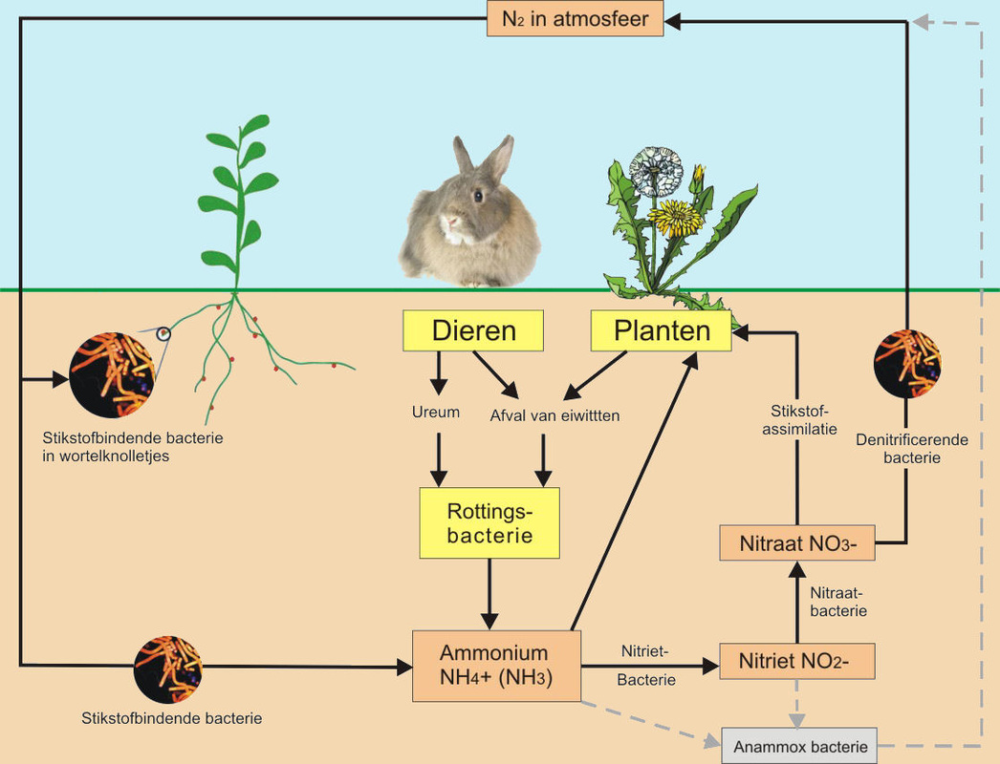

# De stikstofkringloop

De stikstofkringloop, ook bekend als de stikstofcyclus, is het proces waarbij stikstof in verschillende vormen door de biosfeer, lithosfeer, hydrosfeer en atmosfeer van de aarde circuleert. Stikstof is een essentieel element dat nodig is voor de opbouw van eiwitten en DNA, wat essentieel is voor al het leven op aarde.

De stikstofkringloop omvat verschillende stappen:

1. **Stikstofgas (N2) in de atmosfeer**:
   - De atmosfeer bestaat voor ongeveer 78% uit stikstofgas (N2), maar deze vorm van stikstof is onbruikbaar voor de meeste organismen.

2. **Stikstoffixatie**:
   - Stikstoffixatie is het proces waarbij speciale bacteriën (zoals Rhizobium) of bepaalde blauwalgen stikstofgas omzetten in ammoniak (NH3) of nitraat (NO3-), die door planten kunnen worden gebruikt.

3. **Plantenopname**:
   - Planten nemen stikstof op in de vorm van ammonium (NH4+) of nitraat (NO3-) uit de bodem.

4. **Voedselketen**:
   - Dieren verkrijgen stikstof door het eten van planten of andere dieren die stikstofhoudende verbindingen bevatten.

5. **Uitscheiding en dood**:
   - Dieren scheiden stikstofhoudende afvalstoffen uit, zoals ureum, dat uiteindelijk weer in de bodem terechtkomt. Dode organismen dragen ook bij aan de kringloop door hun ontbinding.

6. **Denitrificatie**:
   - Denitrificerende bacteriën zetten nitraat terug om in stikstofgas, waardoor het terug in de atmosfeer komt.

7. **Ammonificatie**:
   - Bacteriën zetten organisch stikstofrijk materiaal om in ammonium (NH4+), dat weer beschikbaar wordt voor planten.

De stikstofkringloop is van cruciaal belang voor het behoud van een evenwichtige leefomgeving op aarde. Echter, door menselijke activiteiten zoals landbouw en industriële processen, is er een overschot aan stikstofverbindingen in de atmosfeer gekomen, wat kan leiden tot negatieve milieueffecten zoals verzuring van bodem en water, vermesting en veranderingen in biodiversiteit. Daarom is het belangrijk om de stikstofkringloop goed te begrijpen en te beheren.

--

1. **Wat is de stikstofkringloop en waarom is het belangrijk voor de natuur?**
   - De stikstofkringloop is het proces waarbij stikstof in verschillende vormen door de biosfeer, lithosfeer, hydrosfeer en atmosfeer van de aarde circuleert. Het is belangrijk omdat stikstof een essentieel element is voor het leven op aarde en nodig is voor de opbouw van eiwitten en DNA.

2. **Welke vorm van stikstof is het meest voorkomend in de atmosfeer, en waarom kunnen de meeste organismen dit niet direct gebruiken?**
   - De meest voorkomende vorm van stikstof in de atmosfeer is stikstofgas (N2). De meeste organismen kunnen dit niet direct gebruiken omdat het een zeer stabiele tweevoudige binding heeft tussen de stikstofatomen, waardoor het moeilijk te breken is.

3. **Wat is stikstoffixatie en welke organismen zijn in staat tot dit proces?**
   - Stikstoffixatie is het proces waarbij bepaalde bacteriën (zoals Rhizobium en cyanobacteriën) en bepaalde blauwalgen stikstofgas (N2) omzetten in ammoniak (NH3) of nitraat (NO3-), die door planten kunnen worden gebruikt.

4. **Hoe nemen planten stikstof op en in welke vorm?**
   - Planten nemen stikstof op in de vorm van ammonium (NH4+) of nitraat (NO3-) uit de bodem.

5. **Wat is denitrificatie en waar vindt dit proces plaats in de stikstofkringloop?**
   - Denitrificatie is het proces waarbij denitrificerende bacteriën nitraat terug omzetten in stikstofgas (N2), waardoor het terug in de atmosfeer komt. Dit proces vindt voornamelijk plaats in zuurstofarme omgevingen zoals moerassen en bodems met beperkte zuurstoftoegang.

6. **Hoe dragen dieren bij aan de stikstofkringloop?**
   - Dieren dragen bij aan de stikstofkringloop door stikstofhoudende verbindingen op te nemen via hun voedsel en deze weer uit te scheiden als afvalstoffen zoals ureum.

7. **Wat gebeurt er met stikstof wanneer organismen sterven?**
   - Wanneer organismen sterven, dragen ze bij aan de stikstofkringloop door hun ontbinding, waarbij stikstofhoudende verbindingen vrijkomen.

8. **Wat is het effect van overmatige stikstof in de bodem en het water op het milieu?**
   - Overmatige stikstof in de bodem en het water kan leiden tot negatieve effecten zoals verzuring van bodem en water, vermesting van ecosystemen, en verstoring van de biodiversiteit.

9. **Waarom is de stikstofkringloop gevoelig voor verstoring door menselijke activiteiten?**
   - De stikstofkringloop is gevoelig voor verstoring door menselijke activiteiten omdat we met name door landbouw en industrie grote hoeveelheden stikstofverbindingen in de kringloop brengen, wat kan leiden tot overmatige belasting en verstoring van ecosystemen.

10. **Hoe kunnen we duurzamer omgaan met de stikstofkringloop in landbouw en industrie?**
    - We kunnen duurzamer omgaan met de stikstofkringloop door het gebruik van kunstmest te verminderen, efficiënter om te gaan met de bemesting van gewassen, en technieken toe te passen die de emissie van stikstofverbindingen naar het milieu verminderen.