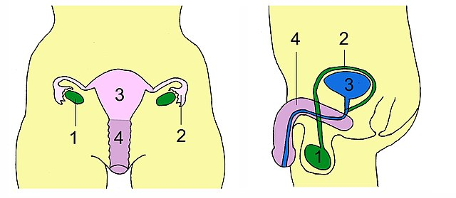
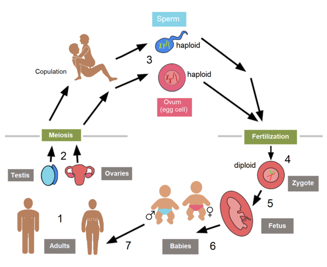
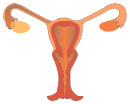

# Biologie VMBO 3 - K3T3

[bio4bart](https:/tinyurl.com/bio4bart)

## **Opdracht neem uit de rode koffer een voorbehoedsmiddel.**

1. zoek eerst de naam op de verpakking of elders
2. zoek op internet informatie over dit voorbehoedsmiddel
1. hoe het werkt?
2. of je soa's ermee kan voorkomen
3. zou je het mensen aanraden ja of nee, waarom wel of waarom niet

## Joost
- [Afspeellijst voorplanting](https://youtube.com/playlist?list=PLr1tx9agautGYRFwXjPTb9RPI-Q9j8VzO&si=Bw3I-g_BGJ3mzwbG)
- [YT B1 Het voortplantingsstel van de man](https://youtu.be/O3WQzcfOFNg?si=jOdoYm-uw6LygmZI)
- [YT B2 Het voortplantingsstel van de vrouw](https://youtu.be/sRgaeigjjDA?si=R5xZnN_JqSjvRMCF)
- [YT B3 reductiedeling](https://www.youtube.com/watch?v=_txMOrnOdsw)
- [YT B4 geslachtskenmerken, hormonen en menstruatiecyclus](https://youtu.be/S0CulfLs2BI?si=SpO7bPMkXz-Zi-X9)
- [YT B5 Bevruchting en embryonale ontwikkeling](https://youtu.be/ioUFdUOHaO8?si=WwSvts2KUpEWPw2N)
- [YT B6 Geboorte en verdere ontwikkeling](https://youtu.be/_hNHioqILmo?si=rQ3H7wBysJ_EUo7P)
- [YT B7 Seksueel overdraagbare aandoeningen](https://youtu.be/T9uizuzK-48?si=K64ue6vcvKlkSWBz)
- [YT B8 Geboorteregeling](https://youtu.be/XG9qEsMbxrc?si=75R23e5LyywSCo0d)
- [YT B9 Seksualiteit](https://youtu.be/XG9qEsMbxrc?si=75R23e5LyywSCo0d)

## Samenvatting voorplanting
- [T braille Thema 2 Voortplanting samenvatting](samenvattingen/tl/T_voortplanting.md)
- [T pdf Thema 2 Voortplanting samenvatting](samenvattingen/tl/T_voortplanting.pdf)
- [K pdf Thema 2 Voortplanting samenvatting](samenvattingen/k/K_voortplanting.pdf)

## Afbeeldingen

